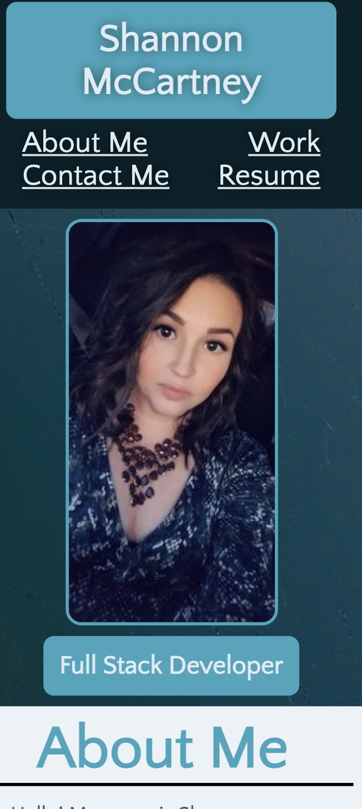

# Advanced CSS Challenge: Professional Portfolio

For this challenge we were given an assignment to build a web application from scratch. By applying the core skills I've recently learned such as flexbox, media queries and CSS variables I was able to build a Portfolio in which I can use to showcase my skills and talents.

## Screenshot Description

Screenshots below show my portfolio uploaded in Git Page:

### Screenshot 1

1. Displays the header of the project with my name
2. Navigation links in which I used flex to position and space. Although not shown a special hover was placed for the buttons so that they change color when touched.

### Screenshot 2

1. Displays a decorative hero image
2. Displays a picture of myself
3. Displays my future title

### Screenshot 3

1. Displays the main content of my page which is the "About Me" & "Work" section.
2. For both these sections I utilized Flexbox to get proper positioning
3. Hover state was use for the imaged to change the look when user is ontop of the images
4. Labels were added ontop of the pictures to describe the project with position relative & absoulte
5. For the First Project which is Run-Buddy a link was placed to take the user to Run-Buddy page to review

### Screenshot 4

1. Displays the Footer of the page
2. Contact section displays various way in which to reach me as well as active links to my Linkden and Github

### Screenshot 5

1. Displays how I used Media Queries to make my portfolio responsive to users viewing my page on a tablet.

### Screenshot 6

1. Displays how I used Media Queries to make my portfolio responsive to users viewing my page on a mobile device.

## URL's
